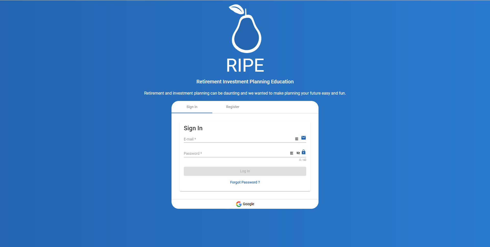
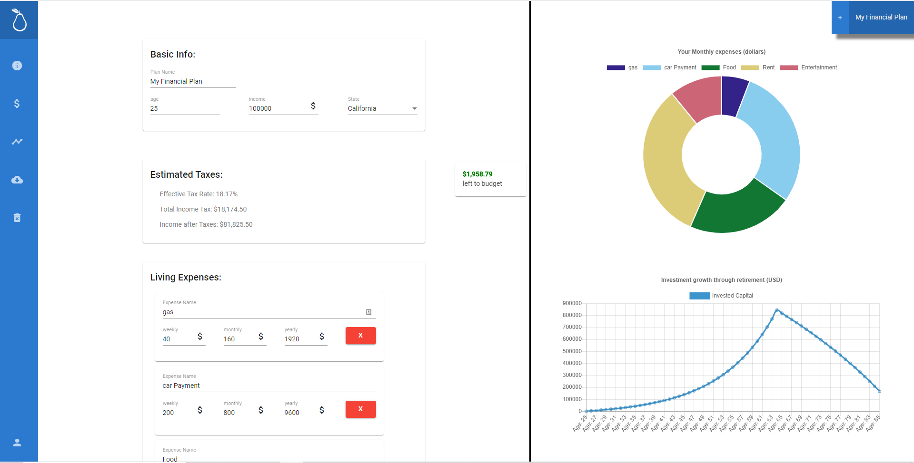
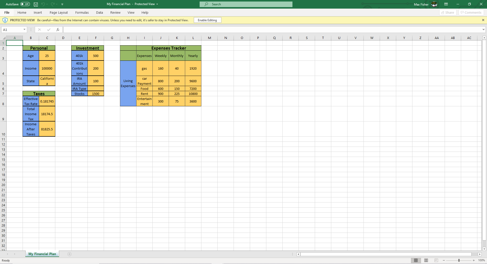

# RIPE - Retirement and Investment Planning Education
This project was first created as part of Slo-Hacks 2020 but was continued afterwards to implement more features

Link to our [devpost](https://devpost.com/software/ripe-q05c8i)

The key feature of our retirement planner is the ability to download your financial plan as a spreadsheet to allow for customization to fit your specific financial situation.

## Screenshots

## Contributing
### Development server

Run `ng serve` for a dev server. Navigate to `http://localhost:4200/`. The app will automatically reload if you change any of the source files.

### Issues
There is a list of active issues under the issues tab and tracking of theese issues is on the github projects board

### Pull Requests

For pull requests to be accepted it must pass our CI witch runs all the test cases and then runs the build in order to ensure a successful build